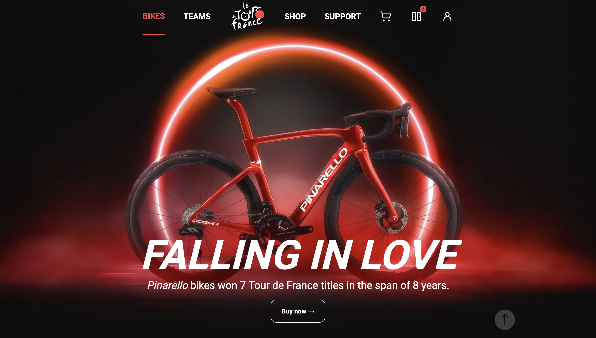
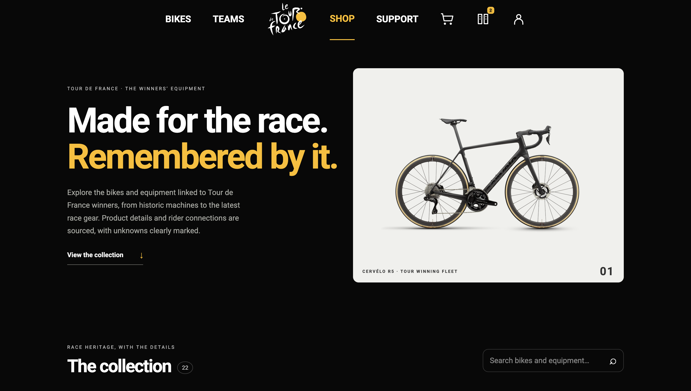
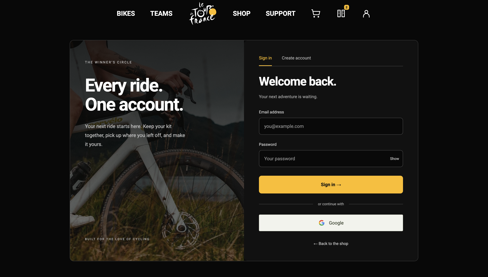

# Fullstack Cycling Store

### Live demo is available [here](https://cycling.158-180-40-180.sslip.io/)

<table>
  <tr>
    <td width="50%" align="center">
      
       For the winners · Colnago V4Rs
    </td>
    <td width="50%" align="center">
      
       Falling in love · Pinarello
    </td>
  </tr>
  <tr>
    <td width="50%" align="center">
      
       The collection · Bikes and equipment
    </td>
    <td width="50%" align="center">
      
       Your account · Sign-in interface
    </td>
  </tr>
</table>

A full-stack cycling shop built with React, Express, and PostgreSQL, inspired by the bikes and equipment of the Tour de France.
Originally created as coursework at the end of my second year at Astana IT College, it has since grown into a complete portfolio project with customer accounts, product management, comparison, and checkout.

The live demo opens directly into a private shop with a sample catalog and example orders. No registration or setup is needed. Each visitor can shop and explore the admin interface without affecting anyone else, and their data expires after 24 hours. Demo orders use the real database; nothing is charged or shipped.

## What this app does

- Explore featured bikes, cycling teams, and a catalog of bikes and equipment on mobile and desktop.
- Search products, filter by category, and sort by price.
- View product images, specifications, race history, and sources, with unknown details clearly marked.
- Compare up to four products side by side, highlighting differences in price, weight, and confirmed Tour victories.
- Add products to a personal cart, adjust quantities, and check stock availability.
- Complete checkout with shipping validation and server-calculated totals, then view saved order history.
- Support customer registration, password login, and Google sign-in when configured; the live demo creates temporary accounts automatically.
- Create, edit, and delete products through an admin interface. In the demo, changes affect only your private shop.
- Keep carts, orders, and inventory in PostgreSQL, with a reset option and automatic cleanup for demo sessions.

## Tech stack

- React 19 frontend with React Router
- Vite build tooling and custom responsive CSS
- Node.js and Express 5 backend
- PostgreSQL database with SQL migrations and the `pg` driver
- Cookie-based authentication, scrypt password hashing, and Google OAuth with PKCE
- Sharp for responsive image generation and WebP optimization
- Node.js test runner for API and database integration tests
- Docker Compose deployment on Oracle Cloud, with Caddy for HTTPS
